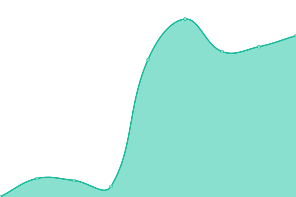

# [Status page](https://status.socialgenius.net) for [SocialGenius.net](https://socialgenius.net)

This repository contains the open-source uptime monitor and status page for [SocialGenius.net](https://socialgenius.net), powered by [Upptime](https://github.com/upptime/upptime).

## [Live Status](https://status.nextpost.tech): <!--live status--> **🟥 Complete outage**

<!--start: status pages-->
<!-- This summary is generated by Upptime (https://github.com/upptime/upptime) -->
<!-- Do not edit this manually, your changes will be overwritten -->
<!-- prettier-ignore -->
| URL | Status | History | Response Time | Uptime |
| --- | ------ | ------- | ------------- | ------ |
|  [SocialGenius](https://www.socialgenius.net) | 🟥 Down | [social-genius.yml](https://github.com/SocialGenius/status/commits/HEAD/history/social-genius.yml) | 

 1166ms
     
 | 

<a href="https://status.socialgenius.net/history/social-genius">99.42%</a>
    

|  [SocialGenius SAAS](https://app.socialgenius.net/login) | 🟥 Down | [social-genius-saas.yml](https://github.com/SocialGenius/status/commits/HEAD/history/social-genius-saas.yml) | 

 290ms
     
 | 

<a href="https://status.socialgenius.net/history/social-genius-saas">98.48%</a>
    

|  SocialGenius Store | 🟥 Down | [social-genius-store.yml](https://github.com/SocialGenius/status/commits/HEAD/history/social-genius-store.yml) | 

 1197ms
     
 | 

<a href="https://status.socialgenius.net/history/social-genius-store">98.49%</a>
    

<!--end: status pages-->

[**Visit our status website →**](https://status.socialgenius.net)
